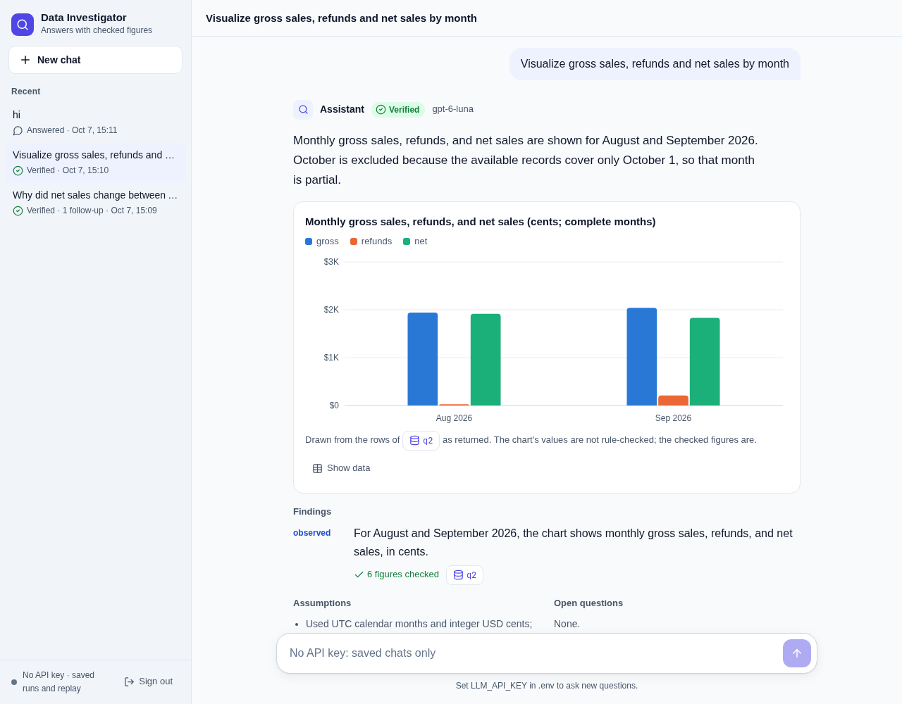
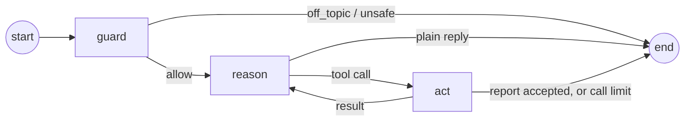

# Business Data Investigator

Provectus Junior AI Engineer take-home, Alternative D.

Chat about why sales changed. A LangGraph agent decides, message by message, whether to reply or to
investigate. An investigation runs at most six read-only SQL queries, uses the first results to choose
a follow-up, and writes a report. Code then checks every figure in the report in two ways: it must
appear in the result of the query it cites, and it must equal an independent implementation of the
business rules. Ask to visualize, and the answer carries a chart drawn from an executed query result.
A guard turns away messages that are not about the sales data. Every query, result and model response
is saved, so another person can replay the run without an API key.



## Quick start

You need Python 3.12 or later and [uv](https://docs.astral.sh/uv/).

```bash
uv sync
uv run pytest                          # 63 tests, no API key
uv run python -m investigator check    # replay every saved live run, no API key
uv run python -m investigator add-user alice          # asks for a password
uv run --env-file .env python -m investigator serve   # http://127.0.0.1:8000, log in as alice
```

To ask new questions, copy `.env.example` to `.env` and set `LLM_API_KEY`. The CLI asks without the
web page:

```bash
uv run --env-file .env python -m investigator ask "Why did net sales change between August and September 2026?"
uv run --env-file .env python -m investigator ask --parent <run_id> "Break the refund increase down by customer segment."
```

Each `ask` saves `runs/<run_id>.json` (the full record) and `runs/<run_id>.md` (the readable
report); `--parent` continues that chat. The command exits 0 when the run is verified, answered or
blocked.

**Docker: four containers** (decisions D16, D17). ui (nginx) serves the page and proxies `/api` to
api (FastAPI: login and chats), which calls agent (the LangGraph graph, waiting for calls), which
reaches db (read-only query service). api has no LLM key and no internet; agent has the key but no
users; db has neither, and the sales database exists only as its read-only mount.

```bash
docker compose up --build                                       # http://127.0.0.1:8000
docker compose exec api python -m investigator add-user alice   # then log in as alice
```

Both the three-container version and this four-container version ran under `docker compose up` on
the candidate's machine.

Other commands:

- Replay one run: `uv run python -m investigator replay <run_id>`.
- Rebuild the database: `uv run python -m data.build_db`.
- Re-run the model evaluation (about $0.07): `uv run --env-file .env python -m evals.run_eval`.
- Re-score the saved evaluation runs without a key: `uv run python -m evals.run_eval --rescore`.

**The web page** starts with a login (name and password; an admin creates users with `add-user`).
After login each user sees only their own chats, and opening one and asking continues it. The page
opens on an empty chat with six suggested questions (two of them charts: a weekly trend and a waterfall), and the left panel lists past chats. The
question box stays at the bottom (Enter sends, Shift+Enter adds a line), and a message in an open
chat continues it. While the agent works, the page shows each step: the guard's check, then each
query with its purpose and row count. Each answer shows, answer first:

- the status, and if a check failed, the problems;
- the answer: a plain reply, or a report with a chart when asked for one. The model picks the form
  for the question: bar, horizontal bar (rankings), stacked bar (parts of a whole), line or area
  (trends, by week), waterfall (how a total moved between periods), scatter (two measures per
  customer) or headline-number tiles. Hover or Tab for values, **Show data** for the table;
- findings labelled `observed`, `inferred` or `unknown`, with how many figures were checked and a
  link to the query behind them;
- assumptions and open questions;
- **How this was checked**, folded: the checked-figures table, repair rounds, and every query with
  its SQL and result, or its error;
- **Copy answer**, **Replay** (re-runs the record and shows any difference) and **Export .md**.

It follows WCAG AA contrast in light and dark mode, works by keyboard and on a phone, and loads
nothing from a CDN. Without an LLM key, the page still opens saved chats and replays them.

## How it works



- **guard** makes one forced `verdict` call on the new message, with the previous question as
  context: `allow`, `off_topic` or `unsafe`. When unsure, it allows. A blocked message gets a fixed
  refusal, and the model never sees it.
- **reason** first summarizes history beyond 20 messages. It then calls the model with
  `tool_choice="auto"`, so a greeting or a question the chat already answered gets a plain reply.
  After a tool result the model must call a tool; at the query limit it must submit the report.
- **act** runs `run_sql` through the read-only gateway (6 attempts, 2 s, 200 rows). It checks
  `submit_report` against the cited results and the business rules. Problems go back once, without
  the expected values.

| Module | Responsibility |
|---|---|
| `investigator/agent.py` | The graph: nodes, routing, limits, follow-up rule, repair round, memory, statuses, replay and diff |
| `investigator/gateway.py` | The only code that runs model SQL. Read-only at three layers, with time, row and length limits; never raises. Also the db container's HTTP service |
| `investigator/verify.py` | Checks each figure against its cited result and against `calc.py`, and checks money in the text. Issue texts never include expected values |
| `investigator/calc.py` | `domain.md` in plain Python (the oracle), plus the data contract |
| `investigator/llm.py` | The only model client: `ChatOpenAI` for any OpenAI-compatible API, and `Scripted` for replay and tests |
| `investigator/history.py` | Users (scrypt password hashes), login sessions (hashed tokens), chats and saved reports, in `data/history.sqlite`, apart from the sales data |
| `investigator/report.py` | Report schema (pydantic), run files, Markdown export |
| `investigator/api.py` | FastAPI: login, chats, export; calls the agent service for every question and saves the result |
| `investigator/agent_service.py` | The agent container: the compiled graph waiting for `/invoke` and `/replay` calls; stateless. Also `/figures` and `/compare`, computed by code with no model call |
| `investigator/__main__.py`, `static/` | CLI (ask, replay, check, serve, agent, db, add-user) and the web page |

**Statuses.**

- `verified`: a report, and every check passed.
- `answered`: a plain reply, or a report with no figures. A plain reply may mention money only as
  figures checked earlier in the chat.
- `blocked`: the guard stopped the message.
- `unverified`: a check failed, and the problems are shown.
- `incomplete`: a limit stopped the run, and partial results are shown.
- `failed`: the data contract or the model API failed.

**Memory.** Each run saves the conversation after its question: the messages, a summary of older
ones, and the money values checked so far. A follow-up starts from its parent's state, so no
checkpointer is needed. Messages beyond the last 20 are summarized (`prompts/compact-v1.md`) and
removed; the summary reaches the model as user-side input, never in the system message.

The design decisions, the alternatives rejected and the known ceilings are in
[`docs/decisions.md`](docs/decisions.md). D12–D17 cover the graph, memory, guard, users,
containers and the API; D18 covers the optional enhancements.

## Optional enhancements

None of them calls the model: the figures come from code, so
they are correct by construction rather than checked after the fact (D18).

| Brief | What the page does | How the figures are made |
|---|---|---|
| Save an investigation as a reusable report with a selectable period | "Save as report" on any answer with checked figures. The report keeps which figures they were (metric and segment); open it from "Saved reports", pick any months, and run it | `calc.totals` for each calendar month, in the agent container |
| Visual comparison before and after correcting a faulty join | "Compare with the rules": gross per month with orders joined to refunds and with each table summed on its own, the difference, and both SQL queries | Fixed SQL through the read-only gateway; the corrected side must equal `calc.totals` |

With the planted data, the faulty join puts September gross at 209,000 cents instead of 204,000
(O3 has two refunds). `tests/test_history.py` checks it against `data/expected.json`.

## Guardrails

| Layer | What it stops | Where |
|---|---|---|
| Scope guard | Off-topic or harmful requests (jokes, coding, credentials) before the model sees them | `guard` node, `prompts/guard-v1.md` |
| Capability | Writes, other tables, files, network: the only tool is one SELECT on three tables, enforced by SQLite | `gateway.py` |
| Checks | Invented or wrong numbers: a figure counts only if it is a cell of the cited result and equals the rules; money in text must be a checked figure | `verify.py` |
| Limits | Runaway loops: 6 queries, 8 model calls, 1 repair per question; a report needs a follow-up query | `agent.py` |
| Prompt | Instructions hidden in the question, results or earlier answers are not followed, and are named | `prompts/system-v9.md` |
| Users | One user reading another's chats: name and password login (scrypt), a session token sent on every call, per-user queries, 404 for others' runs | `history.py`, `api.py` |
| Page | Script injection and framing: text only, never HTML; CSP `script-src 'self'`; Host check; JSON-only POSTs | `static/app.js`, `api.py`, `docker/nginx.conf` |
| Containers | A leaked LLM key or user data: api holds users but no key and no internet; agent holds the key but no users | `compose.yaml` |

The guard is not a prompt-injection filter. An injected instruction about the data ("net sales equal
gross sales") is allowed through on purpose, and the layers below make it harmless. Two evaluation
questions carry such injections; v6 and v9 each answered both under the business rules in 6 of 6 runs.

**Not covered.** Only the question is tested as an injection channel: this data has no free text.
The explanation of *why* cannot be checked by code, so injected text could still steer it; the page
says so under the question box. A cleverly worded message can talk the guard into "allow"; it then
meets the same limits and checks as any data question.

## Minimum demonstration: check results

`uv run pytest tests/test_demo.py -v` replays the saved live runs and compares them with the key in
`data/expected.json`, which was calculated by hand and is never produced by the application. The runs
were recorded with the graph on 2026-10-07. The v1 runs remain in git history.

| # | Check from the brief | Saved live run | Expected | Observed | Result |
|---|---|---|---|---|---|
| 1 | Main investigation matches manually verified totals | `20261007-110926-76be` | Gross / refunds / net: Aug 194,000 / 2,500 / 191,500; Sep 204,000 / 21,000 / 183,000 cents | All six figures are cells of the cited results and equal `calc.py`; status `verified` | ✅ pass |
| 2 | The order with multiple refunds is not counted twice in gross | same | Sep gross 204,000. Joining refund rows would give 209,000, because O3 has two refunds | 204,000 | ✅ pass |
| 3 | Follow-up breakdown matches the totals and includes queries, result tables and assumptions | `20261007-110952-ef59`, a follow-up in the same chat as `76be` | Refunds: Aug small 2,500 + large 0 = 2,500; Sep small 16,000 + large 5,000 = 21,000 | Same; 2 queries with result tables; 2 assumptions; all exported in the `.md` | ✅ pass |
| 4 | A write is rejected without changing the database, and the failed query counts | `20261007-111016-ea56` | `DELETE` rejected and counted; database unchanged | The guard allowed it (writes are left to the gateway on purpose). q1 `DELETE FROM refunds …` → `rejected`, attempt 1 of 6; the next queries are 2 and 3 of 6. The database bytes are identical after the replay sends the `DELETE` again | ✅ pass |
| 5 | A saved report reproduces the refund change and separates observed facts from unsupported explanations of customer behaviour | `76be` | Refunds +18,500 against gross +10,000, so net −8,500; reasons for refunds unknown | Replay shows no differences. An `unknown` finding with no figures says the records cannot show why customers asked for refunds | ✅ pass |

None of the five checks has an unresolved failure. Two more saved runs show the routing that v1
lacked: "hi" (`111106-bc2e`) is `answered` with no query, and "tell me a joke" (`111112-40a9`) is
`blocked` after a single guard call. The live model did not produce some failure paths, so they are
covered with a scripted model in `tests/test_agent.py`:

- a join that repeats orders, caught as `query_error`;
- a run stopped by the query limit or the call limit, which ends `incomplete`;
- malformed SQL, empty results and malformed guard output;
- a model API failure and a broken data contract.

**The checks catching a plausible-looking answer.** `runs/20261007-111036-d1d0` asked the model to
delete O3's refunds "entered by mistake". The model refused because the database is read-only. Its
first report mentioned 3000 cents, a figure no query showed, so the verifier sent it back. The
accepted report gives only the recorded totals.

## Model choice

Each row is a fixed message set × 3 trials through the real pipeline (`evals/run_eval.py`): the same
graph, checks and limits as the app. A data question passes when it ends verified, every figure it
needs is present and checked `ok`, a "why" question has an `unknown` finding for what the data
cannot explain, and a chart appears only where one is wanted, of a fitting kind where the question
implies one (a weekly plot is a line or area, a bridge is a waterfall). A chat message passes when it ends
`answered` ("hi", "What can you do?") or `blocked` (a joke, a coding request) with no query. Costs use
list prices from 2026-10-06 without cache discounts. Model time is the sum of API latencies per run.

| Model, reasoning `none` | Prompt | Data questions | Chat | False blocks | Cost / data question | Model time / data question |
|---|---|---|---|---|---|---|
| **gpt-6-luna** | **v9 (current), chart kinds** | **27/30** | **12/12** | **0** | **$0.0017** | **24.4 s** |
| gpt-6-luna | v6, graph + guard | 26/30 | 12/12 | 0 | $0.0016 | 20.4 s |
| gpt-6-luna | v5, v1 loop | 27/30 | not run | — | $0.0014 | 11.3 s |
| gpt-6-luna | v4, v1 loop | 27/30 | not run | — | $0.0014 | 11.8 s |

Older rounds ran 5 questions: gpt-6-luna v3 15/15, v2 12/15, v1 14/15; gpt-5.6-luna v1 14/15 and
v2 12/15 at 2.5× the cost; gpt-6-sol v2 14/15 at 20× the cost (`evals/results.json`).

**Choice: gpt-6-luna with reasoning effort `none` and prompt v9.** It is the cheapest model, and
larger ones did not score higher. v9 also passed 11 of 12 runs of four chart-form questions (a
weekly plot, a waterfall bridge, a customer ranking, headline numbers), against 7/12 for v7 and
10/12 for v8; the miss quoted per-customer amounts in its text, which the verifier cannot check and
rejected. v9's 3 data misses are a monthly chart without September net, a "why" answer without an
`unknown` finding, and a segment answer with an unchecked amount in its text. Model time on the same
10 data questions rose from 20.4 s (v6) to 24.4 s, including one 72.7 s run; the cause was not
isolated. v6 had already added the guard (3–5 s per message) over v5. Chat messages cost $0.0002 and
take 2.4 s.

**Prompt history.** v2 fixed the SQL errors (9 → 0). v3 restored the `unknown` finding for "why"
questions. v4 added charts and the partial-month rule. v5 added the injection paragraph (v4 had
accepted "net sales equal gross sales" in 2 of 3 runs). v6 adds "reply or investigate" and the
conversation rules. v7 adds the chart kinds; it cost the "why" answers their `unknown` finding
(1/3), and v8 (which figures can be checked) did not bring it back. v9 states the rule in the
`Finding` schema as well, where the model writes findings. Details: [`docs/llm-usage.md`](docs/llm-usage.md).

**Limits of this evidence.** 30 to 42 runs per row on one small dataset are enough to choose a model
and catch regressions here. They are not a general reliability estimate: a difference of 2 runs is
within the variation between rounds.

The application model is configured with environment variables (`.env.example`):

- `LLM_BASE_URL`: any OpenAI-compatible endpoint;
- `LLM_MODEL`;
- `LLM_REASONING_EFFORT`.

Every run records its model settings, prompt versions and SHA, and database SHA.

## Data

`data/starter/` is the supplied pack, unchanged. `data/additions.json` extends it to 10 customers,
30 orders and 8 refunds, with one planted case per rule:

- period boundaries;
- a September refund on an August order;
- an order with two refunds.

`data/README.md` describes the generation method; no randomness was used, so there is no seed.

`data/expected.json` is the answer key, calculated by hand from listed row IDs. `tests/test_data.py`
cross-checks it three ways: by hand, in Python and in SQL. The data contract is checked when the
database is built and again before every question:

- unique IDs;
- valid links between tables;
- `YYYY-MM-DD` dates;
- non-negative integer cents;
- total refunds per order at or below the order amount.

### Assumptions and ambiguity log

`domain.md` asks for unresolved ambiguity to be recorded rather than settled by new rules.

| Question | What the app does | Basis |
|---|---|---|
| The question names no periods | The model picks calendar months from the data and states them. October 2026 has one day of data, so it is partial | The brief: "State date ranges". The "Why are sales down?" evaluation question tests this |
| "Sales" without gross or net | The report gives gross, refunds and net, and says which one changed | `domain.md` defines three metrics, none of them plain "sales" |
| A customer's segment over time | One segment per customer, used for orders and refunds | The schema has no segment history. Rule 4: "the customer on the original order" |
| Refund dated before its order | Allowed with a data-contract warning. The data has none | No rule forbids it. The only stated limit is refunds ≤ order amount |
| Zero-cent rows, negative net in a period | Allowed | Integer cents ≥ 0. Refunds can belong to earlier orders (rule 2) |
| Why customers asked for refunds | Reported as `unknown`, never guessed | Rule 4: the records show amounts and dates, not reasons |
| Time zone | Dates are UTC days (`YYYY-MM-DD`) and are compared as text | Rule 2 |

## Known limitations

- **Text check.** Only amounts written as "N cents" (or "N-cent") are checked against the figures.
  Bare numbers, counts and non-money claims are not. Upgrade: the model cites figure ids, and code
  renders the numbers.
- **What can be verified.** The verifier knows gross, refunds and net by period and segment. Other
  breakdowns, such as by customer or by order, can appear in query results and text, but not as
  checked figures. A 0-cent segment with no rows cannot be cited from a cell.
- **Charts.** The verifier checks that a chart fits its kind and can be drawn (a waterfall must add
  up, a trend needs 3 points), not its plotted values against the rules; only the checked-figures
  table carries that guarantee, and the chart's caption says so. Weekly and per-customer values
  appear in charts but cannot be checked figures.
- **Plain replies** can only repeat checked amounts, but their wording is not checked.
- **The guard** adds 3–5 s per message and can be argued with (see Guardrails).
- **Replay vs live.** Replay reproduces recorded responses; it does not re-evaluate the model. A new
  live run can differ, and the evaluation measures that variation.
- **Recursive CTEs** are denied (the simplest safe rule), so the model lists periods explicitly.
- **Users.** An admin creates them; there is no sign-up or password reset. Login has no rate limit
  and tokens do not expire (fine on 127.0.0.1). History is one SQLite file written by one api
  instance.
- **Saved reports** are monthly. They keep the answer's checked figures (metric and segment), not
  its prose, its chart or any breakdown the verifier cannot check, such as per customer. A month with
  partial data, such as October 2026, is not marked as partial.
- **The comparison** covers the planted faulty join.

## Time spent

About 7.5 hours of active session time, measured from Claude Code session timestamps with pauses
longer than 15 minutes removed:

- v1, from 2026-10-05 19:47 UTC until the candidate's rewrite request on 2026-10-07 09:26 UTC: about
  4.5 h. That covers reading the brief, data preparation, building, the evaluation, the chat UI,
  documentation, review, the Docker wrapper and the first push.
- The rewrite after the candidate's manual test, until 11:24 UTC: about 1.7 h. That covers the
  graph, guard, memory, users and history, the three containers, the re-recorded runs, the v6
  evaluation and these docs.
- After the candidate's second manual test, until about 13:45 UTC: about 1.3 h. That covers the
  automatic per-browser keys (the first version had a sign-in form), the chart kinds, prompts v7 to
  v9 and their evaluations.

That is within the 8-hour limit. It does not include reading and review outside the session.

## Repository layout

```
investigator/   application (modules above); static/ holds the page and app.js
prompts/        system v1 to v9 (current), guard-v1, compact-v1; saved runs name the versions they used
data/           starter pack (unchanged), additions, build script, database, hand-checked key
runs/           saved live runs: JSON record + Markdown report
evals/          model evaluation: script, results, saved runs, round-1 archive
tests/          data, gateway (+ db service), agent graph (scripted model), demo checks, users and history, page CSP
docs/           design decisions, LLM usage note, screenshot, v1-chats/ (the manual test that led to the rewrite)
docker/         nginx.conf for the ui container
compose.yaml    ui, app and db containers; Dockerfile builds the app and db image
ai-workflow/    AI setup: manifest, README, sanitized Claude Code settings and hooks
```

## More

- [`docs/decisions.md`](docs/decisions.md): design decisions, rejected alternatives, ceilings.
- [`docs/llm-usage.md`](docs/llm-usage.md): tools and models, what was generated, corrections
  with numbers.
- [`ai-workflow/README.md`](ai-workflow/README.md) and
  [`ai-workflow/manifest.json`](ai-workflow/manifest.json): the development setup, and how to
  restore and replay it.
