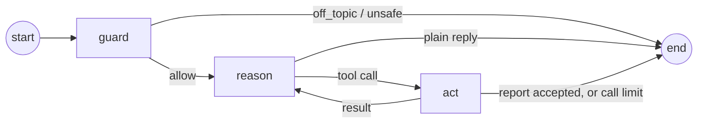

# Business Data Investigator

Provectus Junior AI Engineer take-home, Alternative D.

A chat that answers "why did sales change?" from a small sales database. The agent writes read-only
SQL, looks at the results, asks a follow-up query, and writes a report. **Code then checks every
number in the report** against the query result it cites and against the business rules. A wrong
number never reaches the user as "verified".

**Reviewers: start with the [walkthrough](docs/walkthrough.md)** (5-minute read: approach, findings, checks).


## Quick start

```bash
./start.sh        # needs Docker or uv; then open http://127.0.0.1:8000
```

**Log in as `admin`, password `admin123`.** This default login is created by `start.sh` and is meant
for local use only. It already has saved demo chats, so **no API key is needed** to look around,
replay chats, run saved reports or open the comparison page.

**To ask new questions, add your own API key.** `start.sh` copies `.env.example` to `.env` on the first
run. Open `.env`, fill in one provider block, then run `./start.sh` again. Keys go only in `.env`,
which git ignores; `.env.example` is committed.

| Your key | Lines in `.env` |
|---|---|
| OpenAI (default) | `LLM_API_KEY=sk-...` (the rest is already set) |
| Anthropic | `LLM_BASE_URL=https://api.anthropic.com/v1/`, `LLM_API_KEY=sk-ant-...`, `LLM_MODEL=claude-haiku-4-5`, `LLM_REASONING_EFFORT=` (empty) |
| Anything OpenAI-compatible (OpenRouter, Gemini, Groq, Ollama…) | that provider's `LLM_BASE_URL`, `LLM_API_KEY` and `LLM_MODEL` |

Anthropic works through its [OpenAI-compatible endpoint](https://platform.claude.com/docs/en/api/openai-sdk),
so no extra library is needed. For Claude 5 models (`claude-sonnet-5-5`, …), also set
`LLM_EXTRA_BODY='{"thinking":{"type":"disabled"}}'`: they think by default, and the guard's forced tool
call needs thinking off.

Other commands (Python 3.12+ and [uv](https://docs.astral.sh/uv/)):

```bash
uv run pytest                                   # 66 tests, no API key
uv run python -m investigator check             # replay every saved live run, no API key
uv run python -m investigator replay <run_id>   # replay one run
uv run --env-file .env python -m investigator ask "Why did net sales change between August and September 2026?"
docker compose up --build                       # the same four containers start.sh uses
docker compose exec api python -m investigator add-user alice
```

## How it works


Four containers, each holding as little as possible:

- **ui** (nginx) serves the page and forwards `/api` calls. It is the only container with a published
  port, and only on 127.0.0.1.
- **api** (FastAPI) handles login and saves chats and reports. It has no LLM key and no internet.
- **agent** (LangGraph) runs the investigation. It has the LLM key, but no user data.
- **db** answers SELECT queries on a read-only copy of the sales data. Nothing else can reach the
  data.

Interactive diagram with links to the source: [`docs/architecture.html`](docs/architecture.html)
(download and open it in a browser).

Inside the agent:



1. **guard** decides whether the message is about the sales data. If not (small talk like "how are you?"
   included), the user gets a fixed refusal and the main model never sees the message.
2. **reason** lets the model either reply ("What can you do?") or call a tool. Chats longer than 20 messages are
   summarized first.
3. **act** runs the SQL through the read-only gateway, or checks the submitted report. A failed check
   sends the report back once for repair.

The **Inspector** button (top right of the page) opens a small panel with this graph. While a question
runs, it highlights the node the agent is in and counts each tool call as it starts. For a saved chat,
it replays the last answer's path from the record.

Every answer ends with a status: `verified`, `answered` (no figures to check), `blocked`,
`unverified` (a check failed; the problems are shown), `incomplete` (a limit was hit) or `failed`.

Every question, query, result and model response is saved, so anyone can replay a run without a key.
Design decisions and rejected alternatives: [`docs/decisions.md`](docs/decisions.md).

## Guardrails

| What could go wrong | What stops it |
|---|---|
| Off-topic or harmful requests, small talk | The guard, before the main model sees them. `evals/guard_eval.py`: 33/33 such messages refused, 0/57 data questions refused |
| The model changes the data | A read-only file, `PRAGMA query_only` and a SQLite authorizer that allows only SELECT on three tables |
| Invented or wrong numbers | The verifier: each figure must be a cell of the cited result and equal the rules (`calc.py`) |
| Endless loops | 6 queries, 8 model calls and 1 repair round per question |
| Instructions hidden in the question | The prompt says to name them, not follow them; the checks above still apply |
| One user reading another's chats | Password login (scrypt) and per-user queries; another user's chat returns 404 |
| A leaked key | Only the agent container holds it, and it has no user data |

**Not covered:** the *explanation* of why sales changed cannot be checked by code, and a cleverly
worded message can get past the guard (it then faces the same limits and checks).

## Check results (minimum demonstration)

`uv run pytest tests/test_demo.py -v` replays the saved live runs and compares them with
`data/expected.json`, which was calculated by hand. Amounts are in cents.

| # | Check | Expected | Result |
|---|---|---|---|
| 1 | Main investigation matches the hand-checked totals | Aug gross/refunds/net 194,000 / 2,500 / 191,500; Sep 204,000 / 21,000 / 183,000 | ✅ all six figures verified |
| 2 | An order with two refunds is not counted twice | Sep gross 204,000 (a naive join gives 209,000) | ✅ 204,000 |
| 3 | Follow-up breakdown by segment matches the totals | Sep refunds: small 16,000 + large 5,000 = 21,000 | ✅ same, with queries, tables and assumptions |
| 4 | A write is rejected, counted, and changes nothing | `DELETE` rejected as attempt 1 of 6 | ✅ database bytes unchanged |
| 5 | Facts are separated from guesses about customers | Refunds +18,500, gross +10,000, net −8,500; reasons unknown | ✅ an `unknown` finding says the data cannot show why |

No unresolved failures. Failure paths the live model never produced (bad SQL, limits, API errors)
are tested with a scripted model in `tests/test_agent.py`.

## Model

**gpt-6-luna, reasoning effort `none`, prompt v9.** Each candidate was run through the real pipeline
(`evals/run_eval.py`): 10 data questions and 4 chat messages, 3 times each.

| Model | Prompt | Data questions | Chat | Cost per question |
|---|---|---|---|---|
| **gpt-6-luna** | **v9** | **27/30** | **12/12** | **$0.0017** |
| gpt-6-luna | v6 | 26/30 | 12/12 | $0.0016 |

In earlier rounds, larger models (gpt-5.6-luna, gpt-6-sol) did not beat gpt-6-luna's best score and
cost 2.5× to 20× more. This is enough to pick a model for this dataset, not a general reliability estimate. Prompt
history and corrections: [`docs/llm-usage.md`](docs/llm-usage.md).

Settings live in `.env` (see `.env.example`): `LLM_API_KEY`, `LLM_MODEL`, `LLM_BASE_URL` (any
OpenAI-compatible endpoint), `LLM_REASONING_EFFORT`, and optionally `LLM_MAX_TOKENS` (default 4096)
and `LLM_EXTRA_BODY` (provider-specific JSON). **Claude:** `claude-haiku-4-5` answered the main
question `verified` with correct figures and refused small talk (one smoke run through OpenRouter,
2026-10-07); it was not put through the full evaluation. Each saved run records its model, prompt
versions and database version.

## Data and assumptions

`data/starter/` is the supplied pack, unchanged. `data/additions.json` grows it to 10 customers,
30 orders and 8 refunds, with one planted trap per rule: a refund in a later month than its order,
an order with two refunds, and dates on period boundaries. No randomness was used
([`data/README.md`](data/README.md)). The answer key, `data/expected.json`, is checked three ways: by
hand, in Python and in SQL.

| Unclear point | What the app does |
|---|---|
| No period named in the question | The model picks calendar months and says which. October 2026 is partial (one day) |
| "Sales" without gross or net | The report gives all three and says which one changed |
| Segment changes over time | One segment per customer (the schema has no history) |
| Why customers asked for refunds | Reported as `unknown`, never guessed |
| Time zone | Dates are UTC days |

## Optional enhancements

All three from the brief are built. None uses the model: the figures come straight from code.

- **Saved reports.** "Save as report" on an answer keeps its figures; rerun it later for any months.
- **Faulty join, before and after.** "Compare with the rules" charts September gross as 209,000 with
  the faulty join against 204,000 when computed correctly, with both SQL queries.
- **Switchable assumption.** On the same page, count refunds in the month of the order instead of the
  month paid. Net sales then *rise* from August to September instead of falling.

## Known limitations

- Only amounts written as "N cents" in the text are checked; other numbers and claims are not.
- The verifier knows gross, refunds and net by period and segment. Per-customer or weekly values can
  appear in charts and text, but are not checked.
- Charts are checked for shape (a waterfall must add up), not their values against the rules.
- The guard adds 3–5 s per message.
- Replay repeats the recorded responses; a new live run can differ.
- Users are created by an admin (`add-user`). There is no sign-up, password reset, login rate limit
  or session expiry, and the default `admin` / `admin123` login is public. All of this is acceptable on
  127.0.0.1 only.

## Time spent

About 7.5 hours of active session time, measured from Claude Code timestamps with pauses over
15 minutes removed: 4.5 h for the first version, 1.7 h for the rewrite to LangGraph with users and
containers, and 1.3 h for chart kinds and prompts v7–v9. Reading and review outside the session are
not included.

## Repository layout

```
investigator/   the app: agent graph, SQL gateway, verifier, rules (calc.py), API, web page
prompts/        system prompts v1–v9, guard, chat summary
data/           starter pack, additions, build script, database, answer key
runs/           saved live runs (JSON record + Markdown report)
evals/          model evaluation script and results
tests/          66 tests, none needs an API key
docs/           walkthrough, architecture diagram, decisions, LLM usage note, screenshots
ai-workflow/    the AI setup used to build this: README.md, manifest.json, settings, hooks
```
