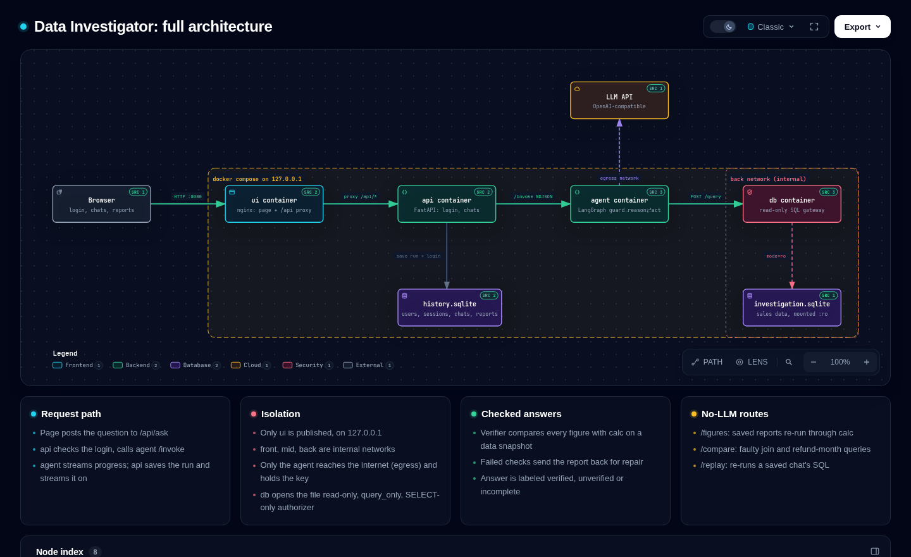

# Walkthrough: Business Data Investigator

A five-minute read on what I built, how it works, what it found, and how I checked it.
Setup and details are in the [README](../README.md).

## The task

A fictional company's net sales fell. Build a tool where a model investigates *why* with a few
read-only SQL queries, chooses a follow-up from the first results, and produces an explanation
whose numbers another person can verify.

## The one idea

**The model explores; code checks.** A language model is good at choosing what to look at next,
and bad at being trusted with numbers. So:

- the model writes the SQL and the explanation;
- every amount it reports must cite a query result, and code checks two things: that the number is a
  cell of that result, and that it equals an independent implementation of the business rules
  (`calc.py`);
- only then is the answer marked **verified**. Otherwise the problems are shown, never hidden.

## How it is built

Four containers, each holding as little as possible:

- **ui** (nginx) serves the page. It is the only container reachable from outside, and only from
  this machine.
- **api** (FastAPI) handles login and stores chats. It has no API key and no internet.
- **agent** (LangGraph) runs the investigation. It has the API key, but no user data.
- **db** answers SELECT queries on a read-only copy of the data. Writes are blocked three times:
  a read-only file, `query_only` mode, and an authorizer that allows only SELECT on three tables.

Inside the agent, a **guard** first turns away messages that are not about the sales data. Then the
model **reasons** and **acts** in a loop, with at most 6 queries, 8 model calls and 1 repair round
per question. The page's **Inspector** panel shows this loop live.

## One investigation, step by step

Saved run `20261007-174625-65ff`: *"Why did net sales change between August and September 2026?"*

1. **Guard:** the message is about the data, so it is allowed.
2. **Query 1:** gross sales, refunds and net sales for both months, plus the first and last dates
   with data (is any month partial?). Result: net fell, gross rose, refunds rose a lot.
3. **Query 2**, chosen after seeing query 1: the same figures split by customer segment, to see where
   the refunds came from.
4. **Report:** three findings, labeled `observed`, `inferred` and `unknown`.
5. **Checks:** all 10 figures match their query results and the rules. The status is **verified**,
   with no repair needed.

The follow-up, *"Break the refund increase down by customer segment"* (run `…-b7aa`), continues the
same chat. It runs 2 queries, shows that the segments add up to each month's total, and is verified
too. Anyone can replay both runs without an API key (`python -m investigator check`), and every
query, result and model response is saved with the run.

## Findings

| Cents | August | September | Change |
|---|---:|---:|---:|
| Gross sales | 194,000 | 204,000 | +10,000 |
| Refunds | 2,500 | 21,000 | **+18,500** |
| Net sales | 191,500 | 183,000 | **−8,500** |

- **Net sales fell because refunds grew faster than sales**, not because sales dropped.
- **Most of the refund increase came from small customers:** +13,500 small, +5,000 large.
- **One refund paid in September was for an August order** (RF4, 7,000). The rules count a refund in
  the month it is paid, so it lands in September.
- **Why customers asked for refunds is unknown.** The records show amounts and dates, not reasons.
  The answer says so instead of guessing.

**Two traps the data contains, and the app avoids:**

- **The faulty join.** Order O3 has two refunds. Joining orders to refunds before summing counts
  O3 twice: September gross becomes 209,000 instead of 204,000.
- **Refund month as an assumption.** Counting refunds by their *order's* month gives September
  refunds of 11,000 instead of 21,000, and net sales would appear to *rise*. The "Compare with the
  rules" page shows both side by side.

## How I know it works

- **The answer key was calculated by hand** (`data/expected.json`) and is never produced by the
  app. Tests check it three independent ways: by hand, in Python and in plain SQL.
- **The brief's five checks all pass** on saved live runs: correct totals, O3 counted once, a
  consistent follow-up, a rejected write that changes nothing, and facts kept apart from guesses.
- **The model was chosen by measurement.** The same questions were run 3 times each through the
  real pipeline. gpt-6-luna passed 27 of 30 data questions, 11 of 12 chart questions and 12 of 12
  chat messages, at $0.0017 per question. Larger models did not score higher.
- **66 automated tests** run without an API key. Failures the live model never produced, such as
  bad SQL, hitting limits or API errors, are tested with a scripted model.

## What went wrong, and how I fixed it

The brief asks for one example of checking AI output and correcting it. There were several; three
show the pattern.

1. **A plausible but wrong breakdown.** The very first live run split refunds by segment with a
   join that gave *each* segment the full total. The verifier caught it and marked the answer
   unverified. A prompt fix ("join only on keys", "check that parts add up") took query errors from
   9 of 39 to 0 of 36.
2. **My own manual test.** In the first version, "hi" and "tell me a joke" were forced through SQL;
   the joke even came back "verified". The cause was the design: every message was treated as an
   investigation. I rebuilt it as a LangGraph graph with a guard in front, so a message can be
   refused, answered in plain text, or investigated.
3. **Small talk.** Late testing showed "how r ya" getting a friendly chat reply. A stricter guard
   prompt now refuses small talk: it let through 24 of 33 such messages before and 0 of 33 after,
   while still refusing 0 of 57 real data questions.

Every prompt version is kept (`prompts/`), and saved runs replay with the version they used.

## Extras

- All three optional enhancements: **saved reports** with any month range, the **faulty-join
  comparison**, and the **refund-month switch**. None uses the model: the numbers come from code.
- **Users and history:** login, private chats, follow-ups that keep the conversation.
- **Any provider:** OpenAI by default; Anthropic and other OpenAI-compatible APIs work through
  settings only.
- **One command:** `./start.sh`, then log in as `admin` / `admin123`.

## Limitations

- Code checks the **numbers**, not the **reasoning**: the explanation of why can still be wrong, and
  the page says so.
- Only amounts written as "N cents" are checked in free text; other numbers in the text are not.
- An amount in the text passes if it equals a checked figure or the difference of two, whatever it is
  said to be: "net sales fell by 18,500 cents" (really the refund increase) would pass.
- The evaluation is small (one dataset, 54 runs for the chosen setup). It is enough to choose a model,
  not to promise general reliability.

Design decisions and rejected alternatives: [`decisions.md`](decisions.md).
How AI was used to build this: [`llm-usage.md`](llm-usage.md).
